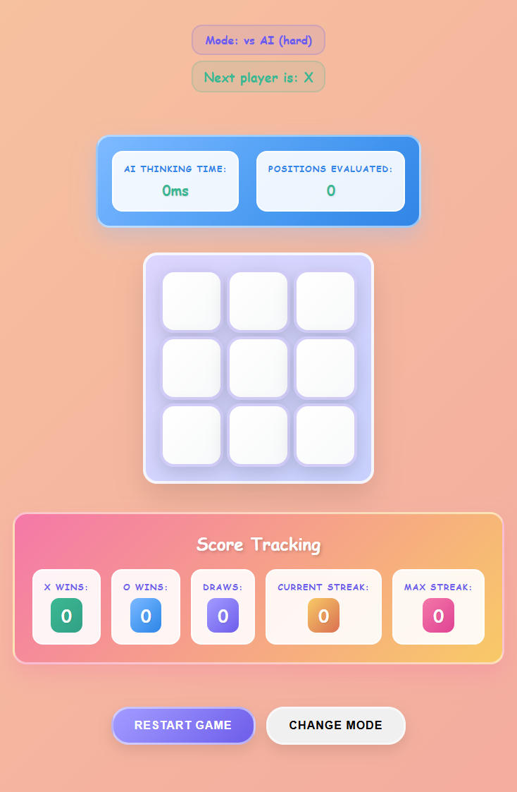

# 🎮 Tic-Tac-Toe

**Author:** Tran Hoang Minh  
**Language:** JavaScript (ReactJS)  

---

## 🧩 Introduction

**Tic-Tac-Toe** is the classic 3x3 grid game where two players take turns marking spaces with **X** or **O**.  
The goal is to be the first to get **three in a row** horizontally, vertically, or diagonally.

This project is built using **ReactJS**, featuring a clean UI and two gameplay modes:
- **Play with Friends:** Two players take turns on the same device.  
- **Play with AI:** Challenge the computer with adjustable difficulty levels.

---

## ⚙️ How to Run

```bash
# 1️⃣ Move into the project folder
cd naver-assignment1

# 2️⃣ Install dependencies (if not already installed)
npm install

# 3️⃣ Start the development server
npm start
The app will run at: http://localhost:3000


🕹️ Game Rules

The board consists of 9 cells (3x3).

Players take turns placing their marks:

Player 1: X

Player 2 (or AI): O

The first player to align three symbols in a row (horizontally, vertically, or diagonally) wins.

If all cells are filled and no one wins → Draw.

🧠 Game Modes
👥 1. Play with Friends

Two human players on the same computer.

Turns alternate automatically after each move.

🤖 2. Play with AI

You control X, and the AI plays as O.

Choose between two difficulty levels:

🟢 Easy Mode: AI plays casually and may let you win.

🔴 Hard Mode: AI uses the Minimax algorithm with Alpha-Beta pruning for optimal moves.

✨ Game Features
🎯 Score Tracking

Tracks wins / losses / draws across multiple games.

Displays your current winning streak.

Persists data using localStorage so scores and history remain after page reload.

⚡ Performance Metrics

Displays the number of positions evaluated (for Hard mode).

Shows AI “thinking time” in milliseconds.

Updates metrics automatically after each AI move.

💡 Additional Features

🔒 Click-lock during AI turn: Player cannot make moves while the AI is thinking.

🧾 Scrollable match history: View all past games with an easy scroll (no limit of 5).

🧠 AI Debug Mode (console): Logs evaluation scores during AI’s decision-making process.

🌈 Victory effects: Celebration popup and confetti when a player wins.

🔄 Quick controls: Restart, change mode, or reset scores anytime.

📸 Demo



📜 License

This project was created by Tran Hoang Minh for educational and demonstration purposes.
Feel free to use, modify, and enhance it as you wish.